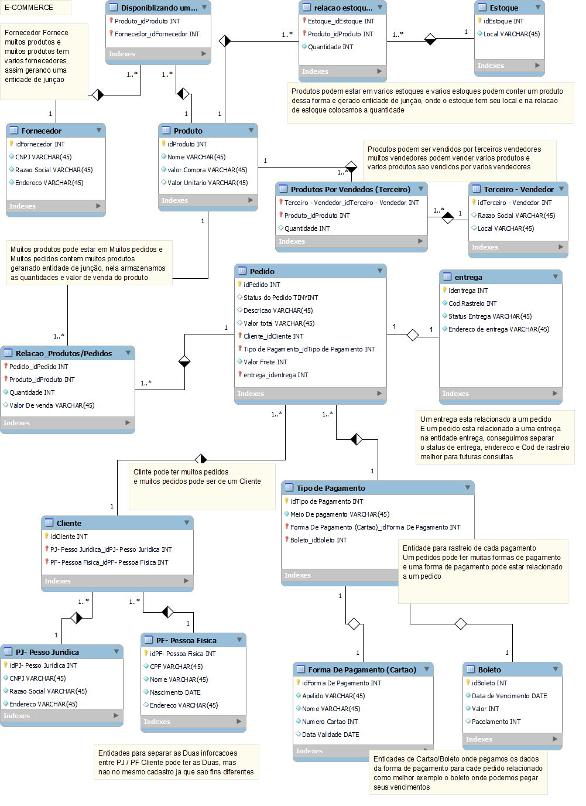

# **Refinando um Projeto Conceitual de Banco de Dados E-COMMERCE**
Projeto proposto no Bootcamp Heineken - Inteligência Artificial Aplicada a Dados com Copilot na plataforma DIO.
## **Descrição do Desafio**
"Modelamos juntos um contexto reduzido de e-commerce. Agora é a sua vez, podes escolher a ferramenta de modelagem para realizar o desafio. Contudo, fique atento! Caso opte por uma variação do modelo entidade relacionamento, como nas ferramentas Mysql Workbench ou DBDesigner será preciso especificar as PK e FKs corretamente. Apesar desse conceito não ser utilizado na modelagem conceitual exploramos brevemente suas definições. Sendo assim, seu empregável será o esquema conceitual para o cenário de E-commerce."

**Instrutora:** Juliana Mascarenhas

## **Objetivo**
Refine o modelo apresentado acrescentando os seguintes pontos:

- **Cliente PJ e PF** – Uma conta pode ser PJ ou PF, mas não pode ter as duas informações;
- **Pagamento** – Pode ter cadastrado mais de uma forma de pagamento;
- **Entrega** – Possui status e código de rastreio;

## **Resolução**
Para atender aos requisitos do desafio, foi criada uma modelagem conceitual aprimorada, considerando todas as exigências descritas.  

Abaixo está a representação gráfica do modelo refinado:  

📎 [Modelagem_ECommerce.pdf](https://github.com/user-attachments/files/19199675/Modelagem_ECommerce.pdf)
